# 第一节课笔记

## 书生·浦语全链条开源开放体系

从数据，预训练，微调，部署，评测，应用6个角度来介绍书生·浦语全链条开源开放体系

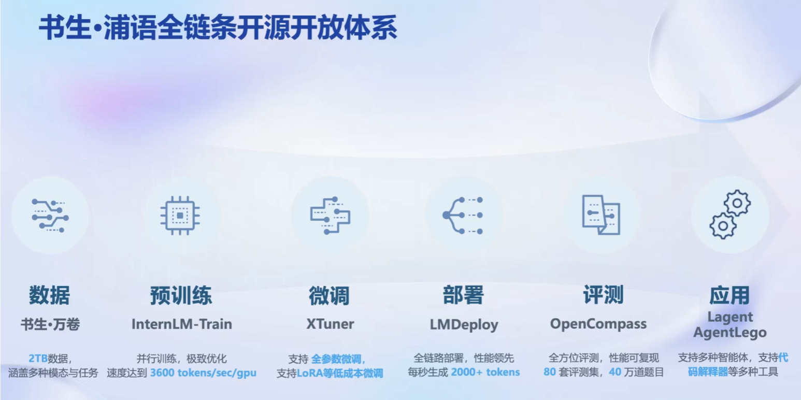

### 数据

- 内容：文本数据，图像-文本数据集，视频数据

- 特点：多模态融合，精细化处理（数据过滤和清洗），价值观对齐

- 数据平台：OpenDataLab

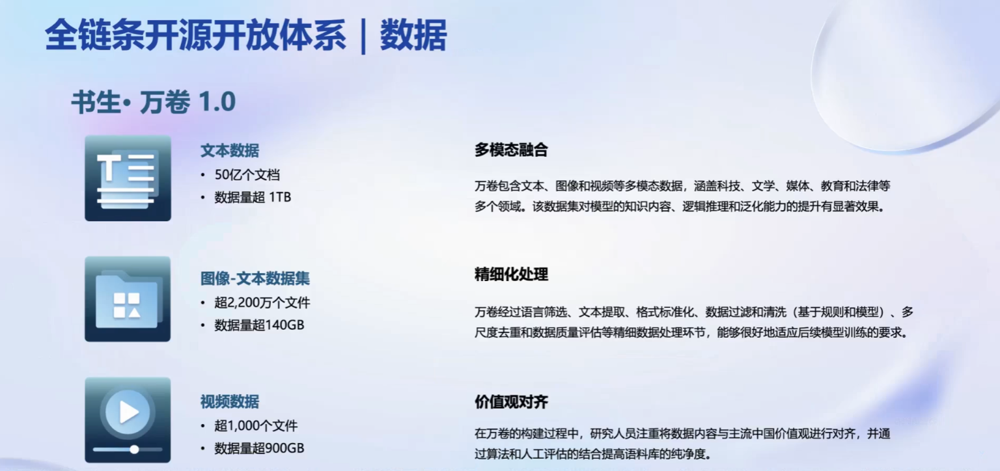

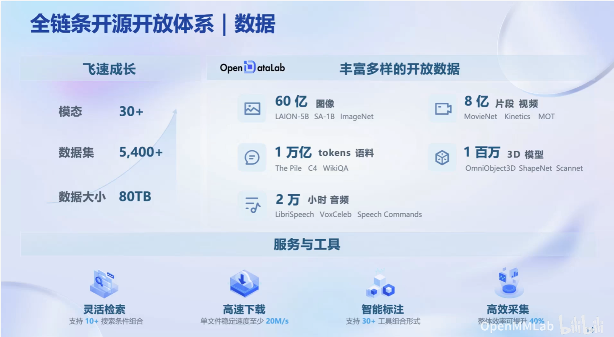

### 预训练

- 高可拓展：支持8卡到千卡的预训练
- 性能优化：Hybrid Zero技术
- 兼容主流：支持HuggingFace
- 开箱即用：支持多种规格语言模型

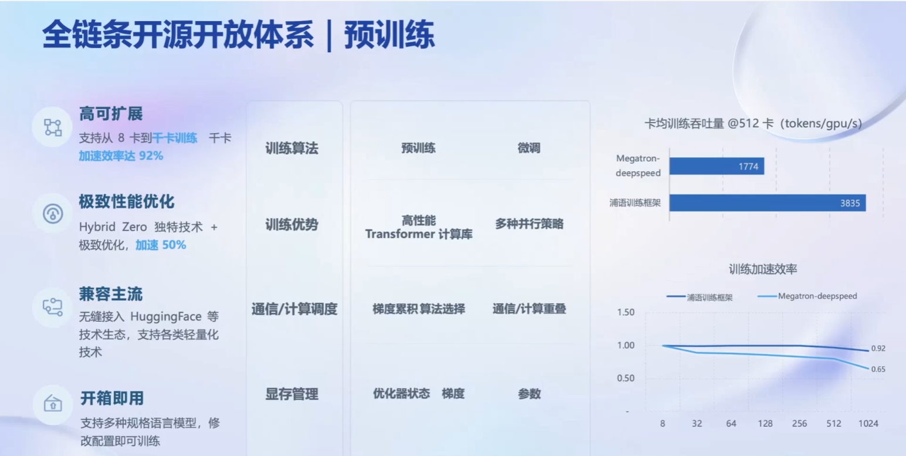

### 微调

- 增量续训：让基座模型学习新的知识
- 有监督微调：让模型学会理解和遵循指令
- 框架：XTuner
  - 多种微调算法：覆盖各类SFT场景（比如Lora，qLora等等）
  - 适配多种开源生态：支持HuggingFace，ModelScope
  - 自动化优化加速

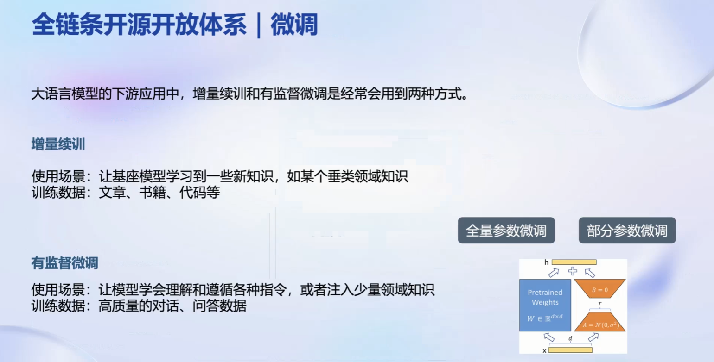

### 评测

国内外评测体系的整体态势

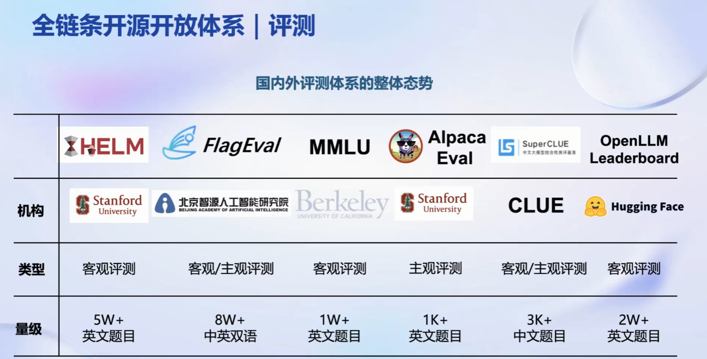

OpenCompass

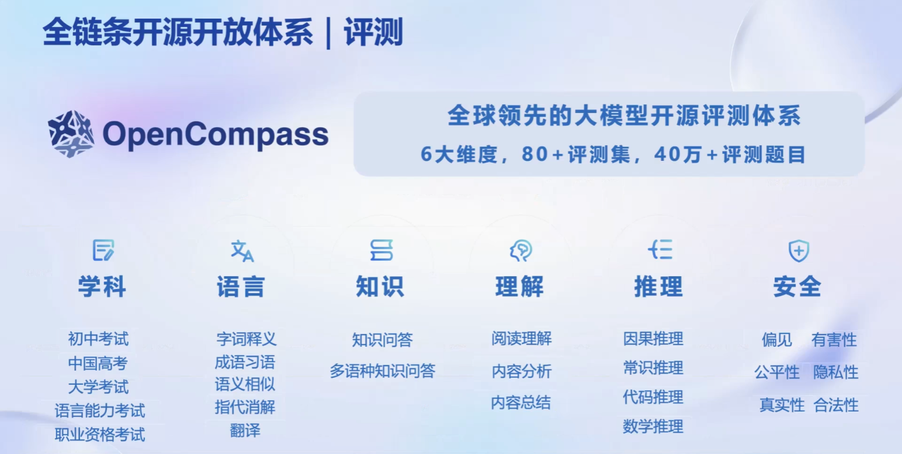

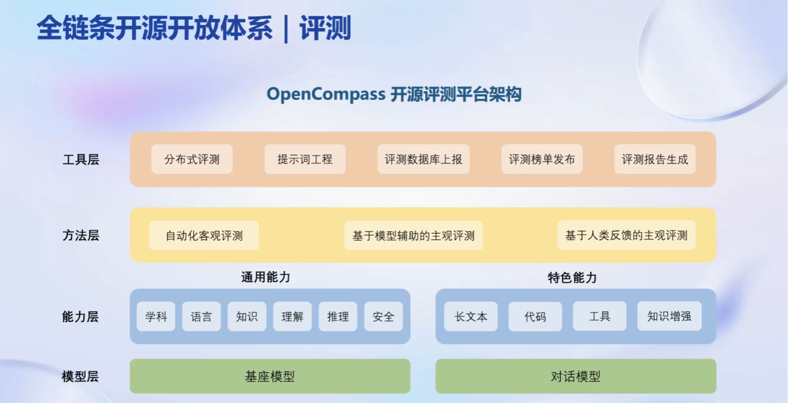

### 部署

- 部署方案

  - 模型并行

  - 低比特量化

  - Attention优化

  - 计算和方存优化

  - Continuous Batching

- 框架：LMDeploy

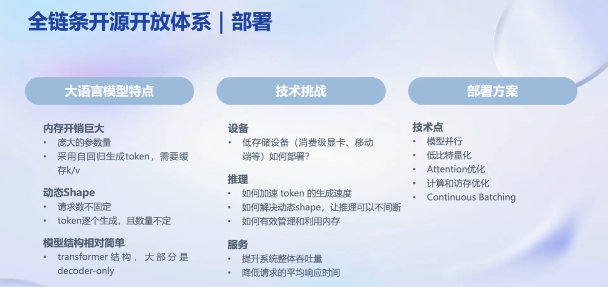

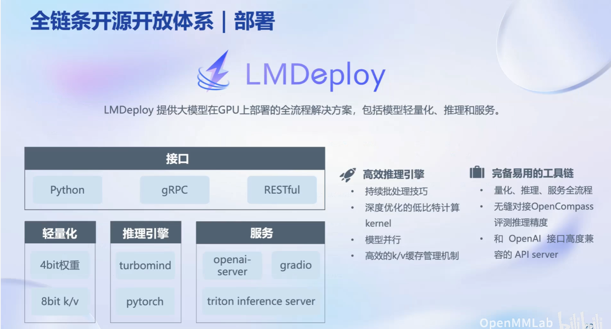

### 应用

- Agent：让大模型具有获取外部知识和自动规划行动的能力
- 框架：Lagent
- 多模态智能体工具箱：AgentLego

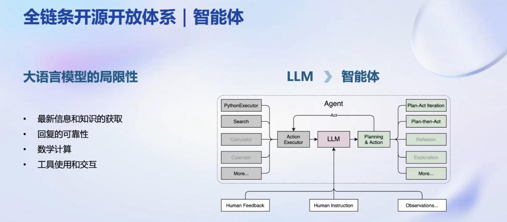

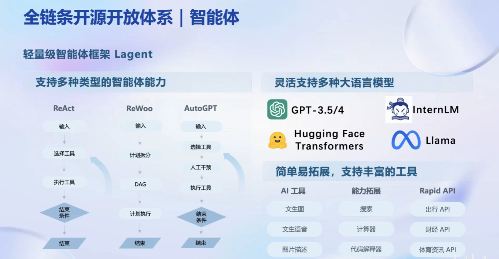

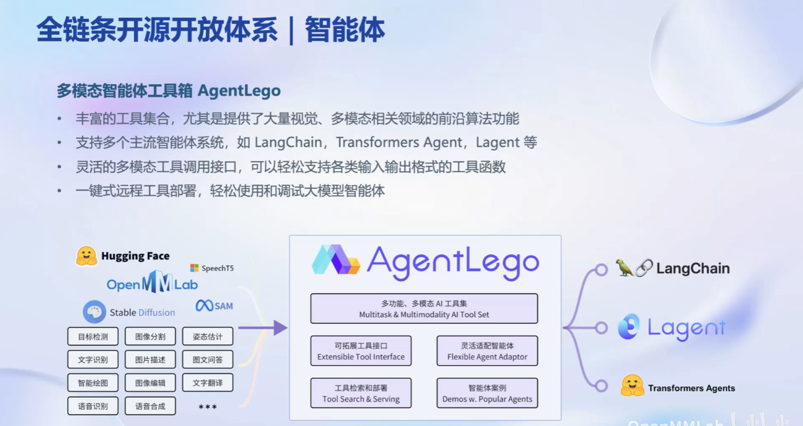