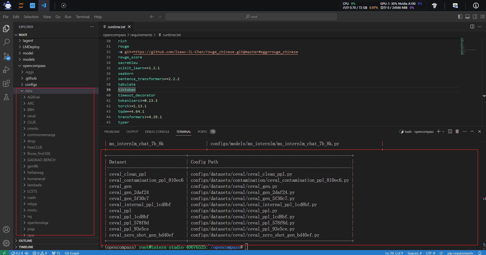
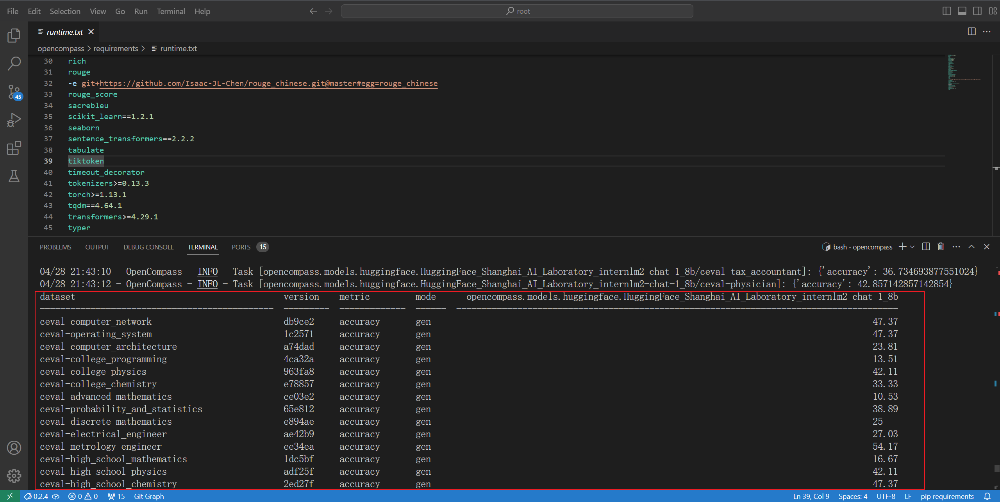

# 第七次课程作业

## 笔记

### 为什么要研究大模型的评测

大型语言模型的研究评测在当前人工智能领域具有举足轻重的地位

- **全面理解模型的能力与限制**
- **指导人机交互设计**
- **规划未来发展与风险预防**
- **公众认知与选择**

### OpenCompass介绍

上海人工智能实验室科学家团队近日发布了名为“司南”（OpenCompass2.0）的大模型开源开放评测体系，该体系为大语言模型、多模态模型等提供了一站式评测服务。OpenCompass2.0以其独特的特性在业界引起了广泛关注。

- **开源可复现**
- **全面的能力维度**
- **丰富的模型支持**
- **分布式高效评测**
- **多样化评测范式**
- **灵活化拓展**

### 大语言模型评测中遇到的挑战

- **全面性问题**

  大语言模型的能力是多元化的，包括语言理解、生成、推理等多个方面。如何选择合适的评测指标来全面、准确地评估模型的能力是一个挑战。同时，一些指标的定义和解释也可能存在争议，需要不断的讨论和完善。

- **评测成本问题**

  大语言模型的训练和评测需要大量的计算资源和时间成本。如何设计一个高效、低成本的评测方案，确保在有限的资源下能够全面、准确地评估模型的能力，是评测中需要关注的重要问题。

- **数据污染问题**

  大语言模型在训练时，用到了海量的互联网数据。为了判别训练数据是包含测试数据，需要发展可靠的数据污染检测技术，设计动态更新的评测基准。

- **鲁棒性问题**

  语言模型在处理不同领域、不同风格、不同语言习惯的文本时，其表现可能存在较大的差异。如何评估模型的鲁棒性和泛化能力，确保模型在各种场景下都能保持较好的性能，是评测中需要关注的重要问题。

### 如何评测大模型

OpenCompass 采用了客观评测与主观评测相结合的方法来全面评估大语言模型的能力。这种方法旨在通过不同的评测维度和场景，更准确地反映模型在多种任务上的表现。

#### 主观评测

主观评测主要针对开放式或半开放式的问题、模型安全等难以用客观指标衡量的方面。这些方面的能力通常需要通过人的主观感受来评价，以更贴近模型的实际使用场景。

OpenCompass 的主观评测方案是通过构建主观测试问题集合，将不同模型对同一问题的不同回复展现给受试者，收集他们基于主观感受的评分。由于主观测试成本较高，该方案还结合了使用性能优异的大语言模型模拟人类进行主观打分的方法。这种结合真实人类专家和基于模型打分的主观评测方式，能够更全面地评估模型在实际使用中的表现。

#### 客观评测

客观评测主要针对具有确定性答案的能力维度和场景。通过构建完善的评测集，使用定量指标比较模型的输出与标准答案的差异，来衡量模型的性能。为减少噪声输出在评测阶段的影响，OpenCompass 对输入和输出进行了规范和设计。

在客观评测中，OpenCompass 采用了两种主要的评测方式：

1. **判别式评测**：该方法基于计算模型在所有候选答案组合上的困惑度，并选择困惑度最小的答案作为最终输出。这种评测方式能够有效地评估模型在识别正确答案方面的能力。
2. **生成式评测**：这种方法主要用于生成类任务，如语言翻译、程序生成等。模型基于问题的输入进行答案的生成，随后对输出进行后处理以满足数据集要求。

为了更好地激发模型在特定领域的能力，OpenCompass 还运用了提示词工程（prompt engineering）和语境学习（in-context learning）的技术。

## 作业

### 环境准备

和先前的课程作业一样，不在赘述

### 准备数据

拷贝共享空间中的数据进行解压

### 评测模型

使用ceval数据集来评测internlm2-chat-1_8b模型

