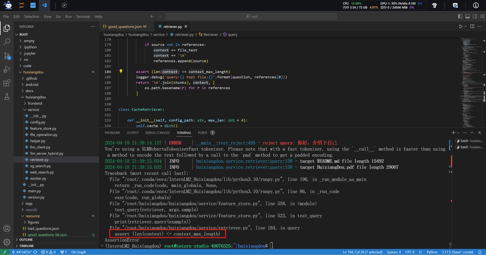

# 第三节课作业

## 茴香豆：搭建你的 RAG 智能助理

1. 创建知识库

   在创建知识库的过程中报错如下，原因是断言不通过，当前content的长度大于脚本设定的最大长度

   

   鉴于没有太多的时间读代码，我直接注释掉该行，再一次运行创建知识库的代码

2. 运行茴香豆

   运行茴香豆，并向它提出三个问题，分别是“huixiangdou 是什么”，“茴香豆怎么部署到微信群”，“今天的天气怎么样？”

   - huixiangdou 是什么

     对于这个问题，茴香豆是这样的回答的

     - 第一，给定prompt，提问该问题的主题是什么

       

     - 第二，输入打分标准并提问当前问题的可回答分数是多少

       

     - 第三，根据可回答分数来选择是拒绝回答还是同意回答

       

   - 茴香豆怎么部署到微信群

     同上述的流程一样，茴香豆的回答如下图所示

     

     

     

   - 今天的天气怎么样？

     同上述的流程一样，茴香豆的回答如下图所示

     

     

     

