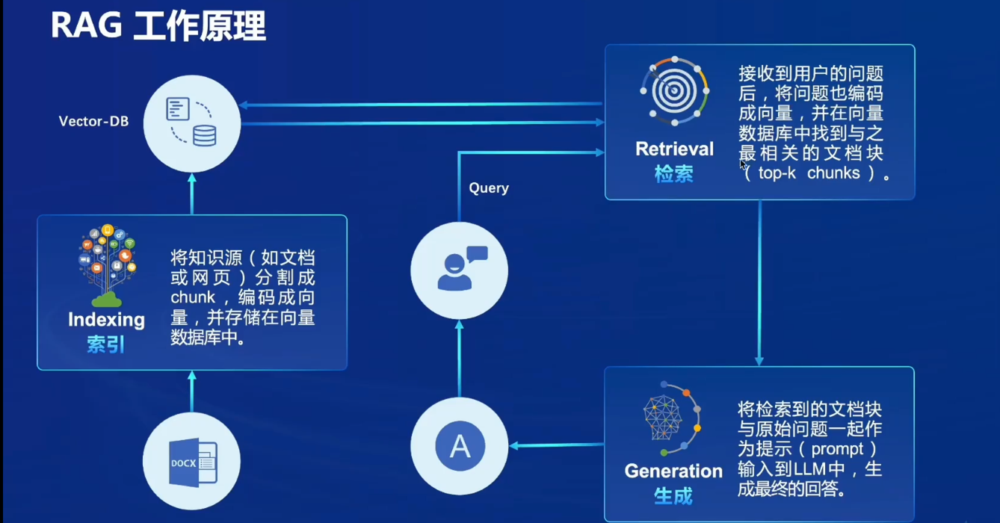
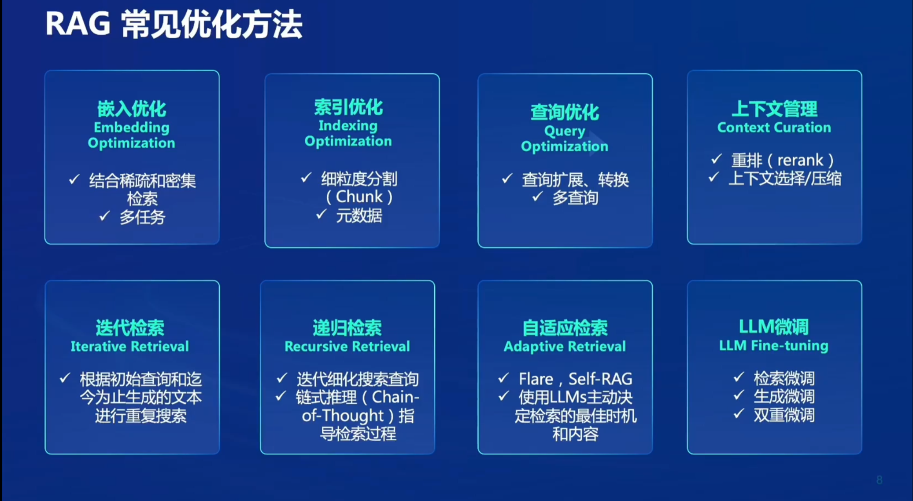

# 第三节课笔记

- 介绍了RAG（Retrieval Augmented Generation），即通过检索来增强模型的生成能力的技术。具体方法是通过建立知识库来丰富大模型的知识。RAG可以优化大模型的幻觉问题。
- 介绍了茴香豆
- 演示部署茴香豆

## RAG的工作原理

1. 存储：将知识通过embedding技术转化成向量存储在向量数据库中
2. 检索：将用户问题编码成向量送入到向量数据库中检索top-k个最相似的文档块
3. 生成：将用户问题和检索到的文档块一起送入大模型生成回答

## RAG的发展进程

- Naive RAG：根据RAG的工作原理简单的实现
- Advanced RAG：在Naive RAG的基础上，对用户问题和文档块进行总结融合
- Modular RAG：结合其他的工具，拓展RAG的功能

## RAG的优化方法

## RAG的能力评测

## 茴香豆的工作流程

茴香豆的定位是一款群聊助手，它服务的用户群体是在聊天群里提出专业问题的人。比如在这样一个场景下，你开源了一个训练大模型的框架，你在discord上建了一个群来帮助使用该框架的用户解决相关问题，但是，问题很多，无法及时回复，于是你添加了一个聊天助手来回复用户的问题。但是群里的消息很杂乱而且大多数的消息是闲聊，在这样的情况下，聊天助手会回复群里所有的消息，包括闲聊消息。我们希望聊天助手只回复和该框架有关的问题而不是所有消息，于是[Kong et al.(2024)](https://arxiv.org/abs/2401.08772)推出了茴香豆这款聊天助手。

茴香豆有4个特点，第一，锁定真正需要回答的问题；第二，严格禁止幻觉产生；第三，理解特定领域知识；第四，不急于回答问题。

- 锁定真正需要回答的问题

  引入拒答模块，拒答模块包括基于Text2Vec和LLM Scoring

  - 使用Text2Vec判断输入问题和向量数据库中片段是否有关，以此为依据来选择是否回答该问题，根据作者的实验，Text2Vec的表现平平，以至于茴香豆很少回答问题。不知道是作者选择的阈值过高还是有太多的闲聊语句，亦或者就是Text2Vec本身的能力并不强大
  - 不能理解作者为什么要引入LLM Scoring来判断是否回答该问题，拒答模块的作用是判断问题主题是否和向量数据库中的知识相关，但是作者给出引入LLM Scoring的理由是Text2Vec容易被语气词影响，个人感觉语气词并不会改变问题的主题

- 严格禁止幻觉产生

  作者认为在群聊环境下直接调用LLM产生幻觉的原因是闲聊话语和LLM自身的推理能力不足（训练语料和特定领域知识没有对齐）。所以作者提出了改良的拒答模块和响应模块来减少幻觉的产生，期望达到严格禁止幻觉产生的效果。

- 理解特定领域知识

  采用了RAG技术和Web Search来作为外部知识库

茴香豆的拒答模块和响应模块都用到了LLM Scoring，个人认为LLM Scoring非常依赖大模型自身的能力，也就是说基座模型的能力起到了决定性的作用。那么对于不同模块的LLM Scoring的阈值是多少呢，从论文来看，LLM Scoring的阈值应该是人为设定的一个值，当茴香豆部署到不同的领域时，该值是否会发生变化，是否有一个机制，会自适应的改变LLM Scoring的阈值？

茴香豆存在的一个问题是，对于用户提出的专业问题，茴香豆无法获取在群聊中的上下文，这样可能导致一个完整的提问过程被割裂，以至于提供的答案不是用户想要的。

在[Kong et al.(2024)](https://arxiv.org/pdf/2401.08772.pdf)和[Yao et al.(2023)](https://arxiv.org/pdf/2210.03629.pdf)这两篇论文中都提到了，对基座模型进行监督微调与采用Cot，RAG这些不改变大模型参数的方法相比较，监督微调后的效果更好

