# 第二节课笔记

## 轻松玩转书生·浦语大模型趣味 Demo

### InternLM-Chat-7B 智能对话 Demo

#### 准备开发环境

1. 创建开发机

   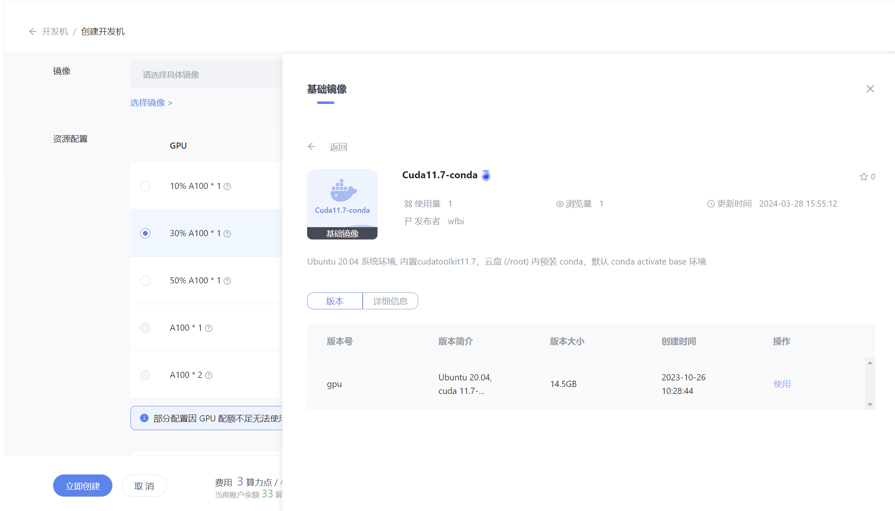

2. 配置环境

   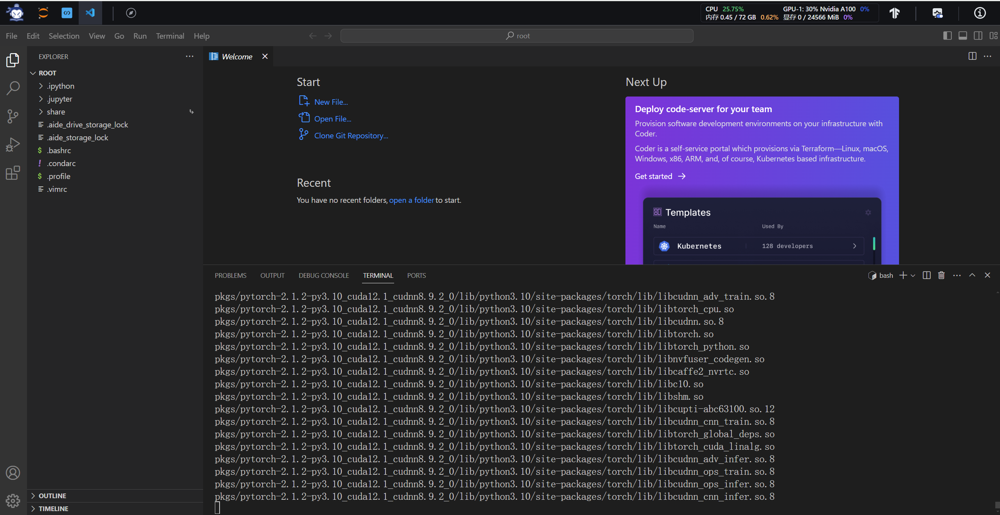

#### 下载模型

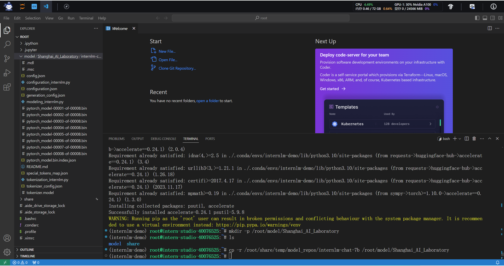

#### 改写代码

改写/root/code/InternLM/web_demo.py中29行和33行的代码，将模型的路径改成本地路径

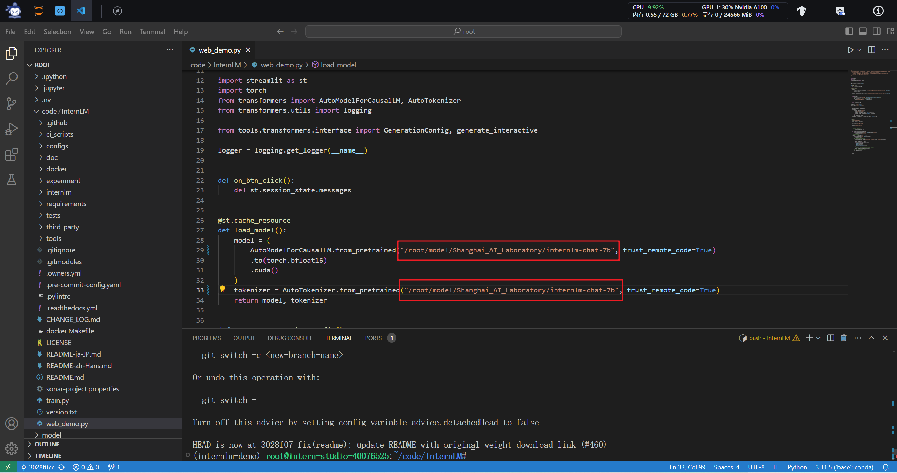

#### 终端运行

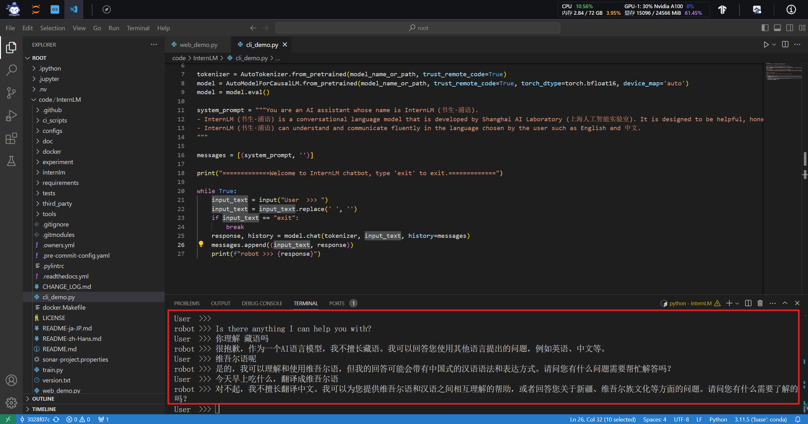

#### web运行

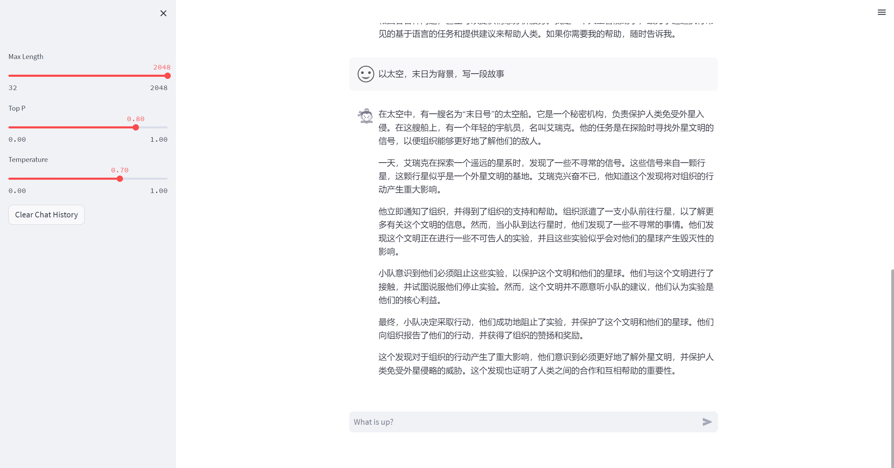

###  Lagent 智能体工具调用 Demo

#### 准备开发环境

同InternLM-Chat-7B 智能对话 Demo

#### 下载模型

同InternLM-Chat-7B 智能对话 Demo

#### 安装Lagent

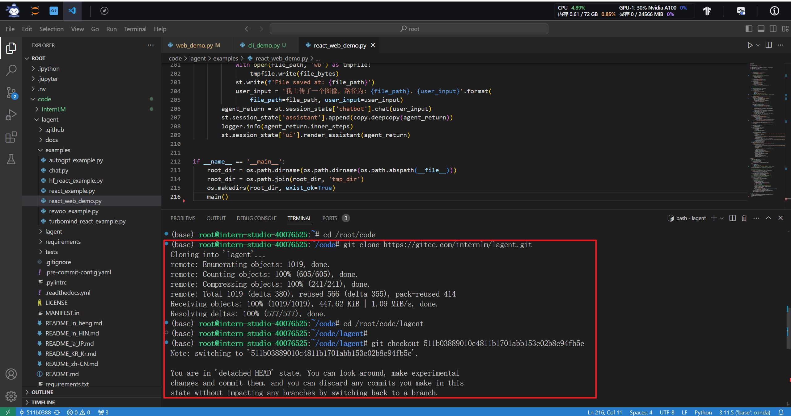

#### 改写代码

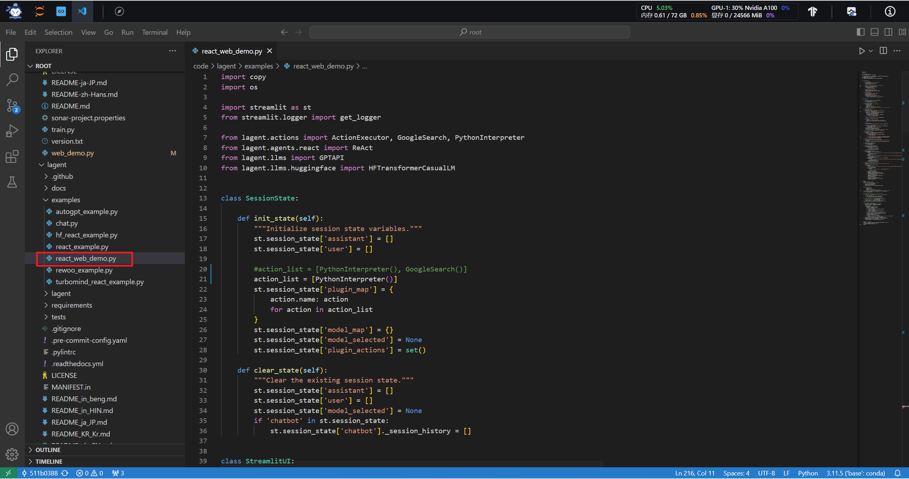

#### 运行Demo

提问当x趋向于正无穷时，sinx的值。
Lagent的反应很快，但是回答错误。处理数学问题时的流程可能需要优化，推测该插件在处理数学问题时，直接进行计算问题的数值答案，而并没有考虑问题本身是具有迷惑性的。

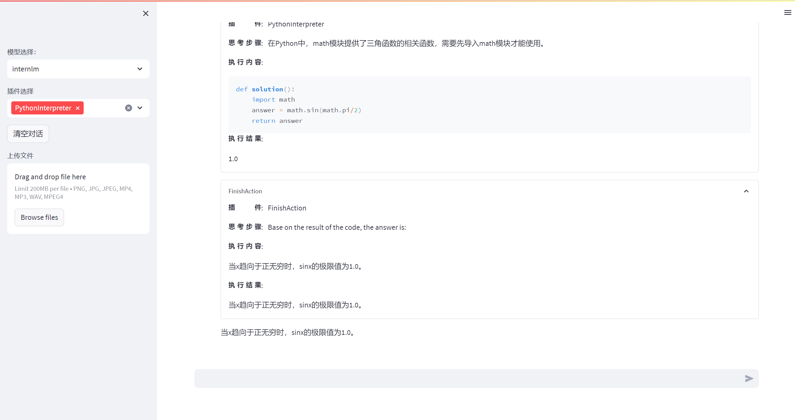

### 浦语·灵笔图文理解创作 Demo

#### 准备开发环境

同InternLM-Chat-7B 智能对话 Demo

#### 下载模型

同InternLM-Chat-7B 智能对话 Demo

#### 下载代码

#### 运行Demo

1. 图文创作功能

   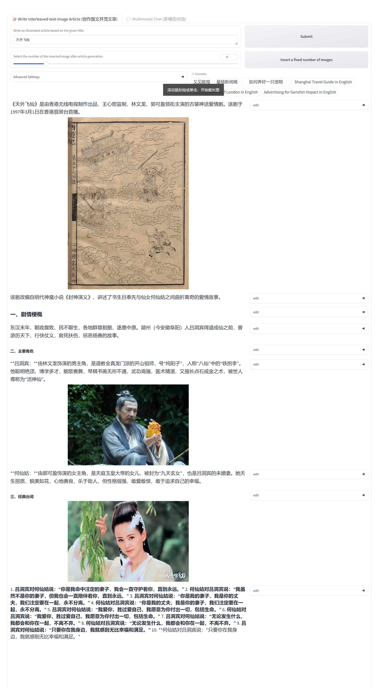

2. 图片理解功能

   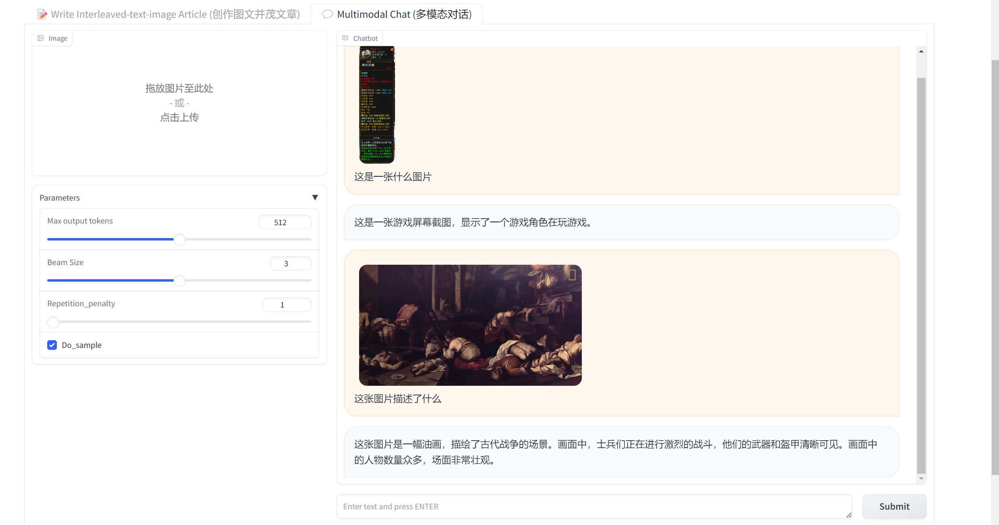

### 使用huggingface_hub下载模型

使用该库需要借助科学上网工具

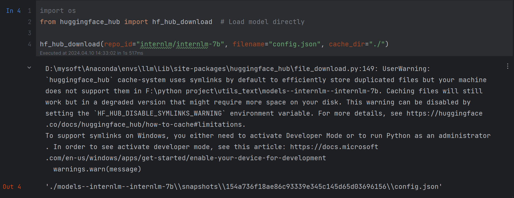

