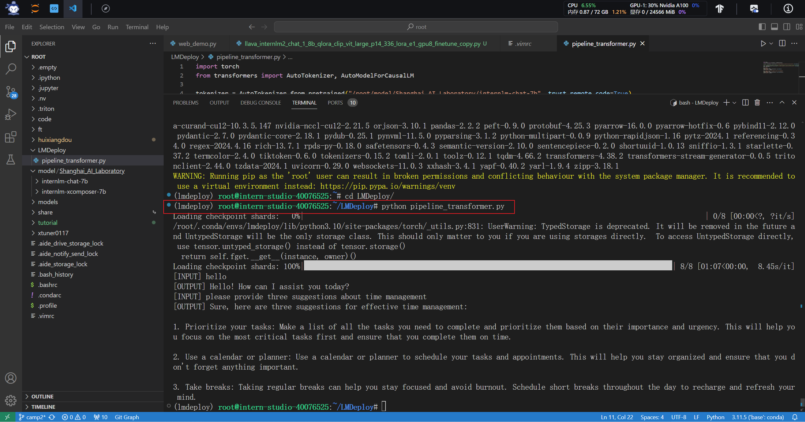
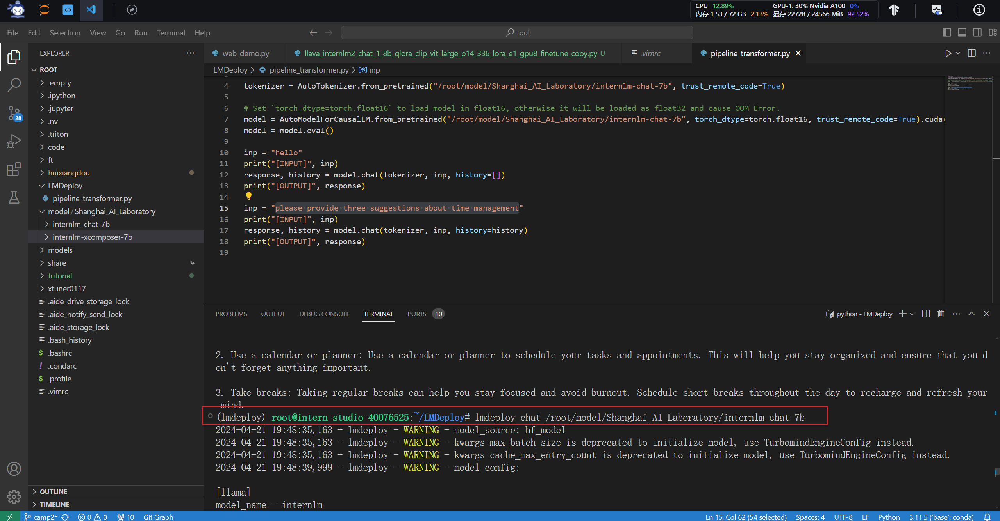
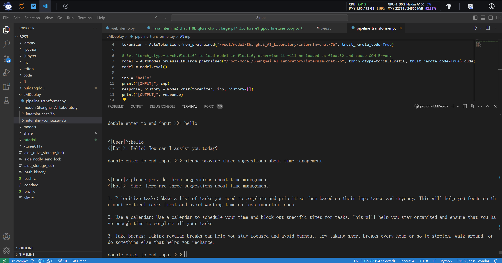
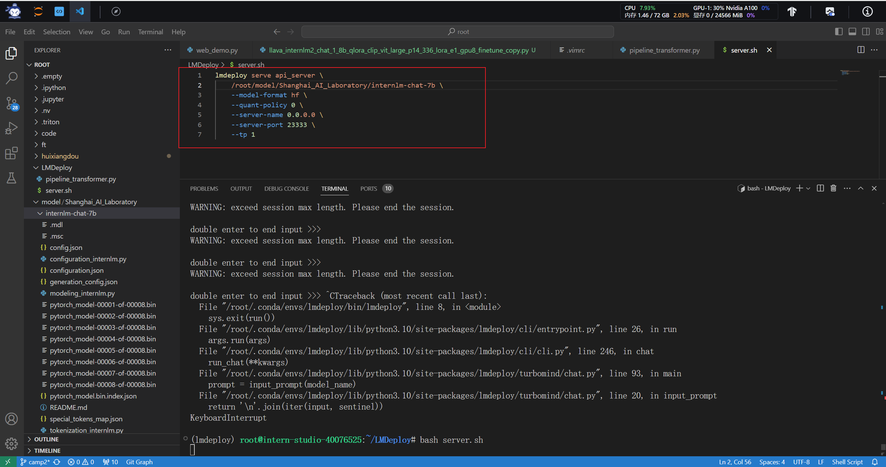
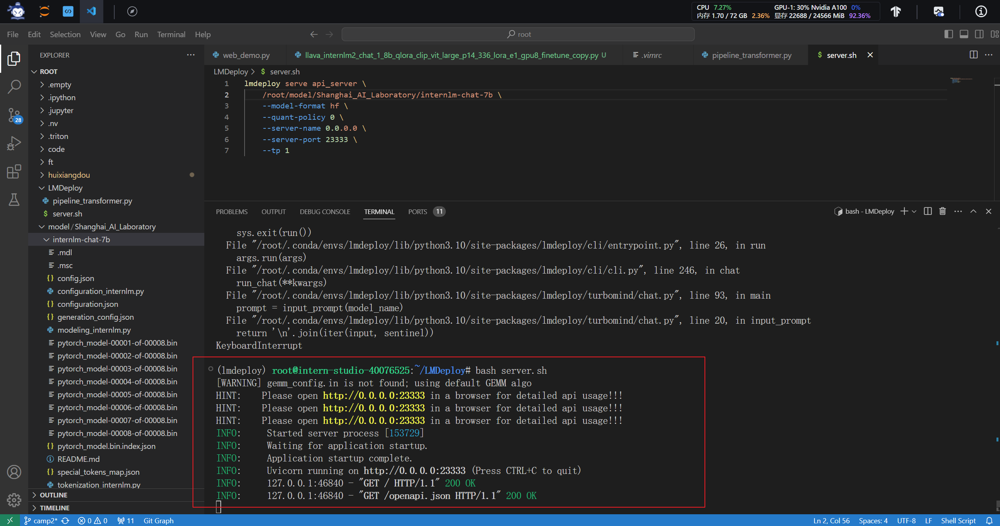
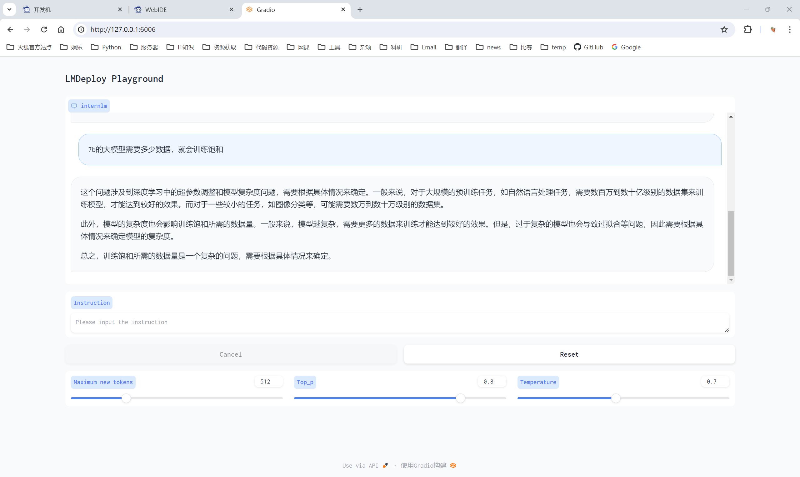

# 第五节课作业

本节课使用LMDeploy来进行模型的轻量化部署

环境的创建和模型的下载就不在赘述了

## LMDeploy模型对话

使用transformer推理模型

使用LMDeploy推理模型

LMDeploy的推理速度非常的快，人可以在直观上直接感受到LMDeploy推理的速度

部署LMDeploy服务

编写启动server脚本

启动server脚本

server运行在http:0.0.0.0:23333地址上

运行命令行客户端连接服务器

(https://github.com/BIUBIUBIU-JIAZHOU/InternLM-Learning/assets/35516323/e28b0c37-e669-4dc6-a230-1221761ca729)

使用网页客户端连接服务器

