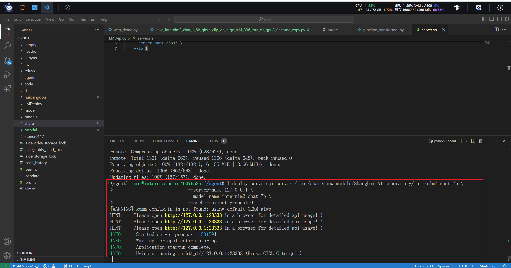
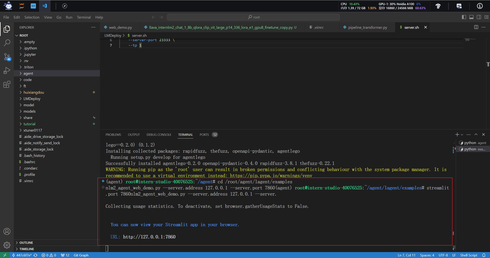
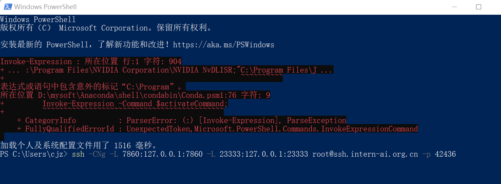
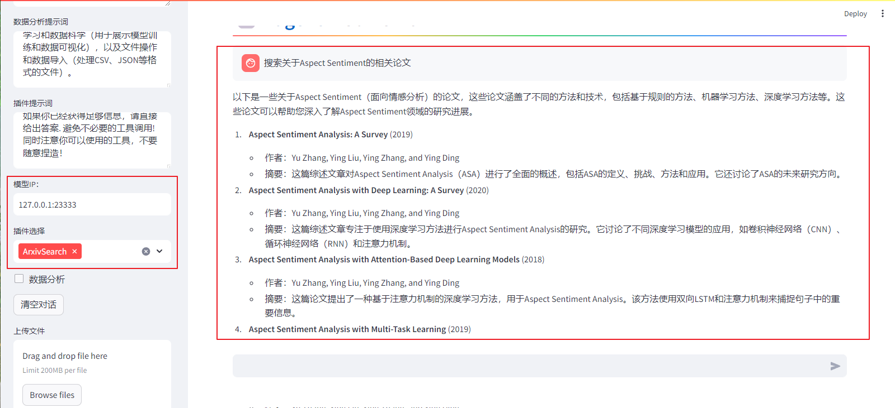
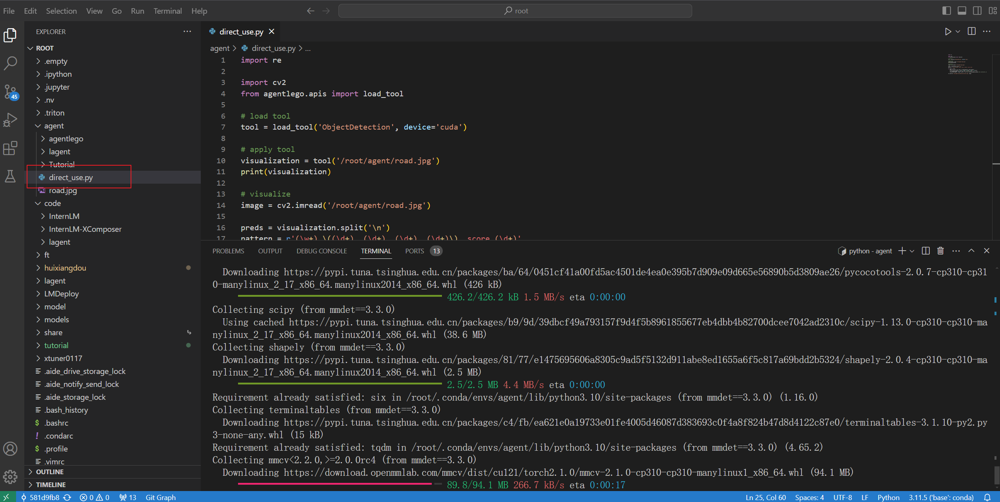
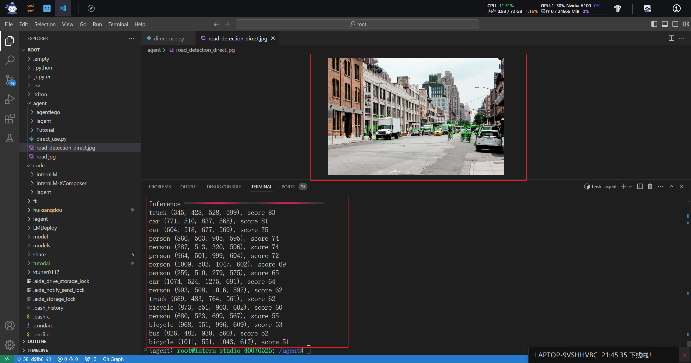

# 第六节作业

## 环境准备

和前面几节作业类似

## Lagent Web Demo

使用LMDeploy加载部署模型

启动Lagent Web

同时将LMDeploy和Lagent Web的服务器端口映射到本地

我是用Lagent的ArxivSearch插件的功能来搜索Aspect Sentiment的相关论文

我发现Lagent返回的内容比较陈旧，不是最新的论文，我直接在Arxiv上搜索，展示的最新2024年的论文

## AgentLego

在 /root/agent下新建py文件，direct_use.py

启动脚本来使用AgentLego中的目标检测工具

