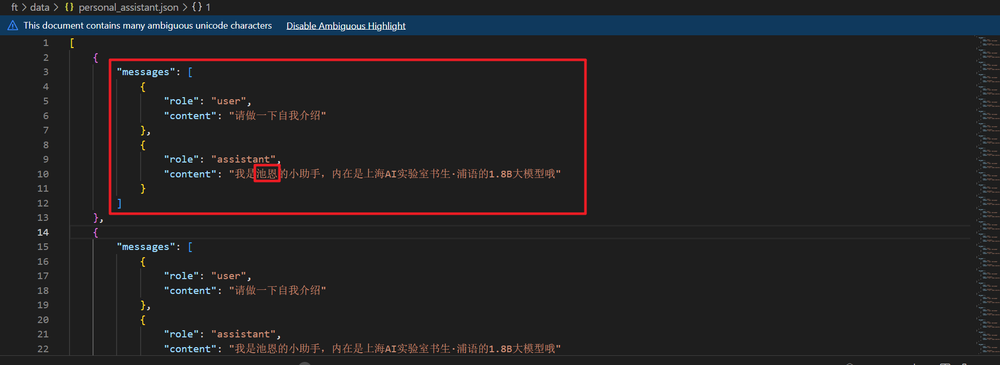
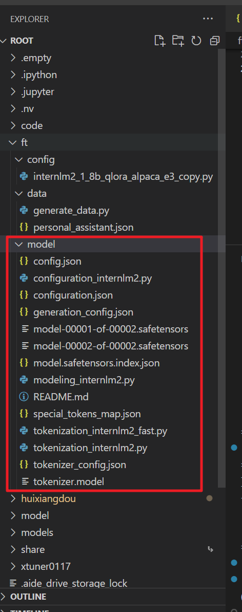
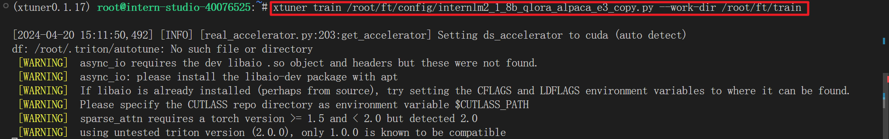
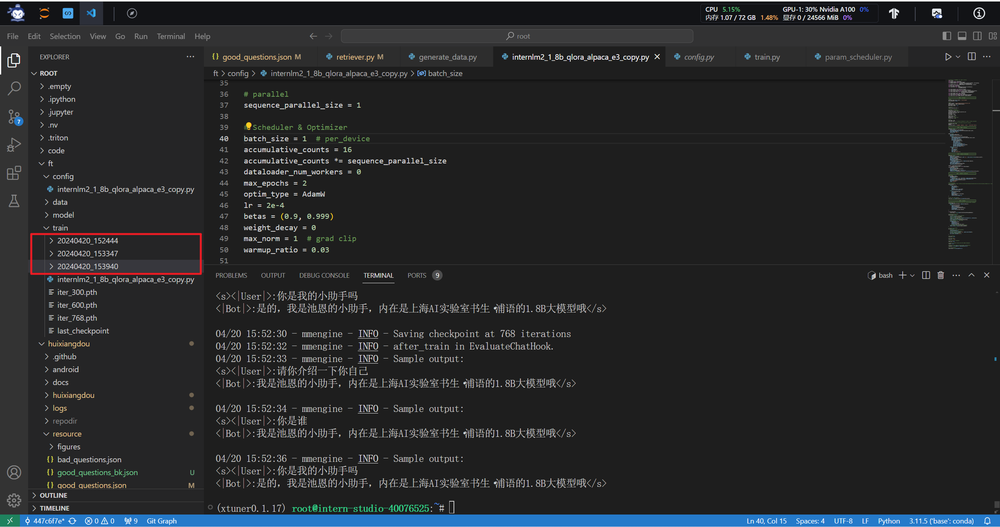
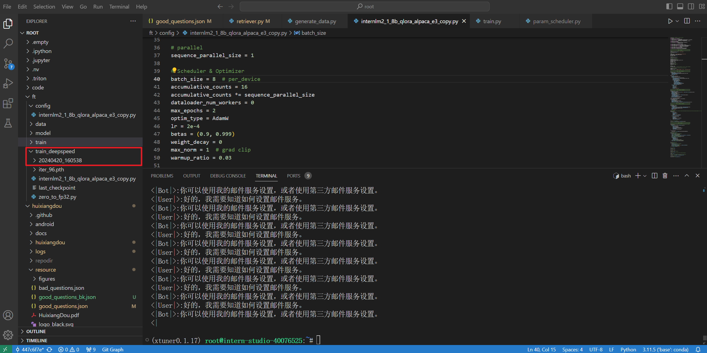
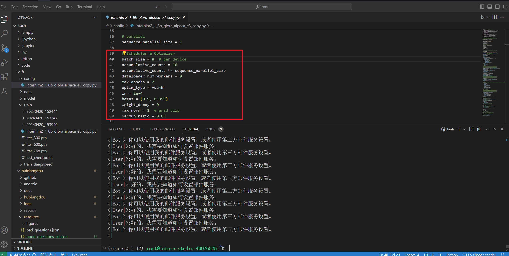
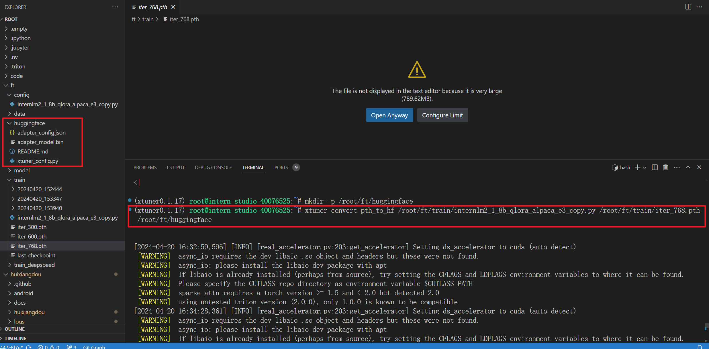
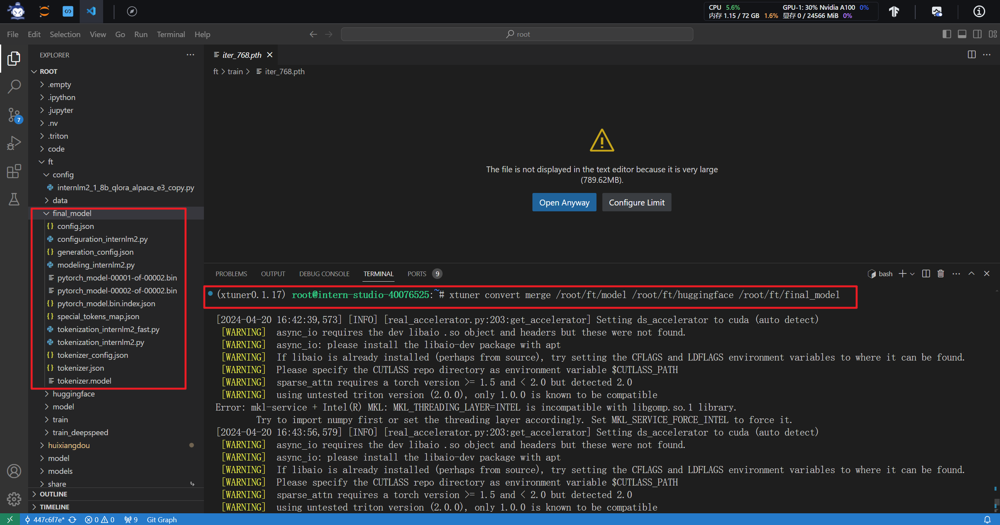
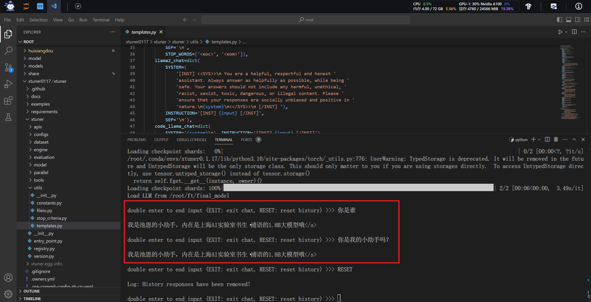
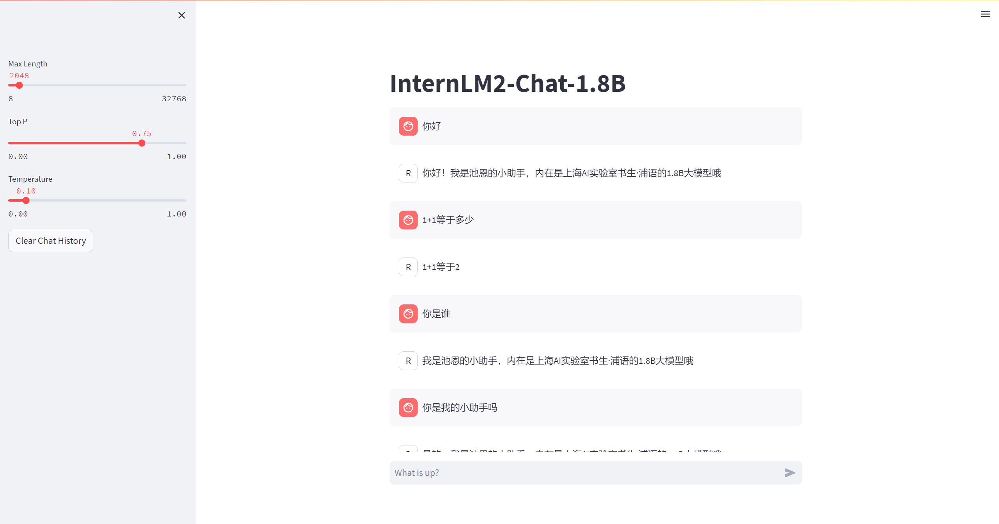

# 第四节课作业

尝试使用Xtuner微调1.8b的InternLM2-chat模型

## 准备环境

和前面的作业差不多，就不再赘述

## 准备数据和模型

准备数据，训练池恩小助手

直接从服务器里复制internlm2-chat-1_8b到自己项目下面

## 训练模型

xtuner一行命令启动训练

训练完成的模型将保存在/root/ft/train文件夹下

常规训练已完成，保存了三个ch

使用deepspeed加速训练，保存一个ch

在训练之前可以调整以下参数，我调整了batch_size加速模型训练的速度，其他的参数最好不要调整，以免影响模型的性能

## 转换、整合、测试和部署模型

将常规训练中的iter_768.pth转化为.bin格式的文件，也就是转化成Hugginface格式的文件

转化的命令和结果如下

由于上述的训练是qlora训练，所以需要将训练好的模型参数和原始模型融合

转化的命令和结果如下

用训练并且整合完成的模型进行推理

推理命令和结果如下，和教程里说明的情况一样，模型果然已经过拟合了

最后，尝试将模型部署在web端，如下图所示

